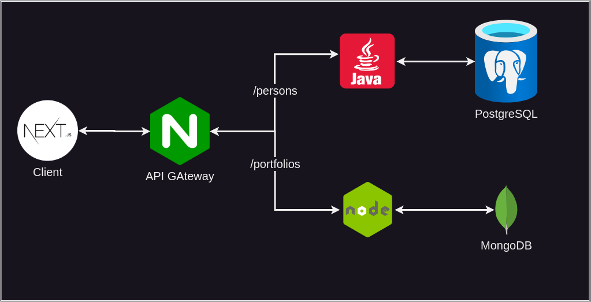

# Car Inspect

## About

This is an application that the user can send some information about a vehicle to get an inspection by insurance companies and so on.

## Architecture

## Layout

Check on [Figma](https://www.figma.com/file/6mHWT5lZy1vFusJOAUpar1/Car-Inspect?type=design&node-id=3%3A37&mode=design&t=x349fdcCikGUTEwl-1)

## Run and Testing

The Insomnia collection is available at [here](./docs/insomnia_2024-01-19.json). To run this project locally you just need docker, just run `docker compose up -d` and access the client at `http://localhost:3000`.

## Contributing

This repository is using [Gitflow Workflow](https://www.atlassian.com/git/tutorials/comparing-workflows/gitflow-workflow) and [Conventional Commits](https://www.conventionalcommits.org/en/v1.0.0/), so if you want to contribute:

- create a branch from develop branch;
- make your contributions;
- open a [Pull Request](https://docs.github.com/en/pull-requests/collaborating-with-pull-requests/proposing-changes-to-your-work-with-pull-requests/creating-a-pull-request) to develop branch;
- wait for discussion and future approval;

I thank you in advance for any contribution.

## Status

Maintaining

## License

[MIT](./LICENSE)
